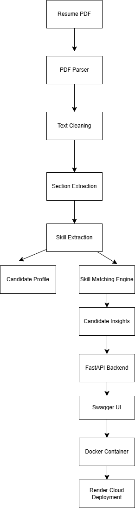
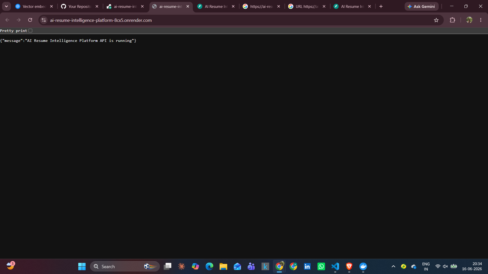
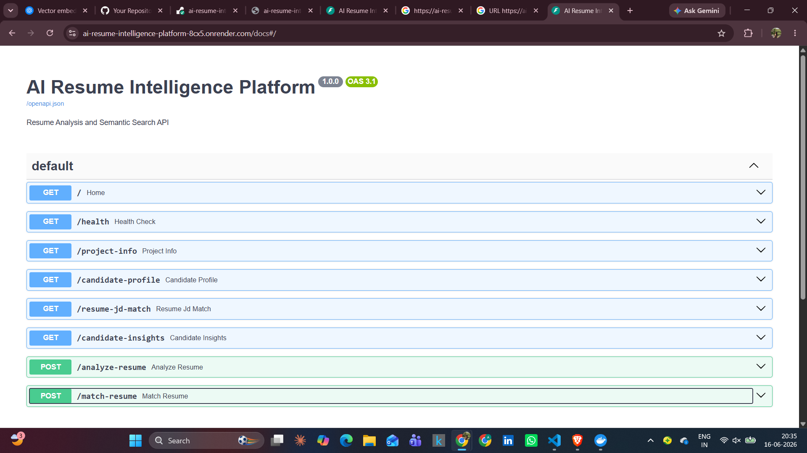
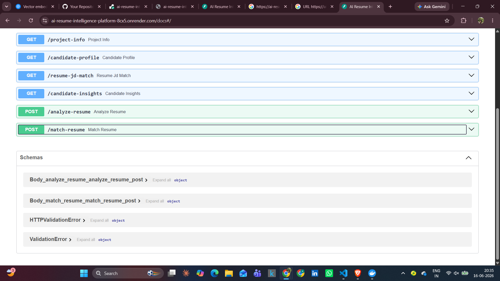
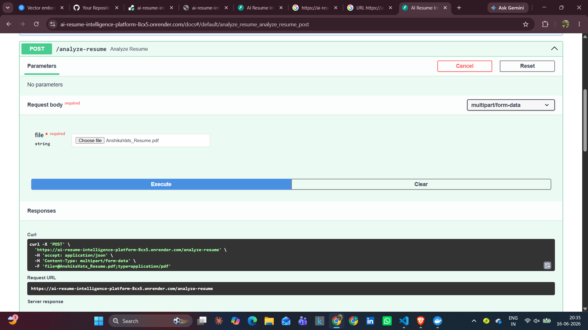
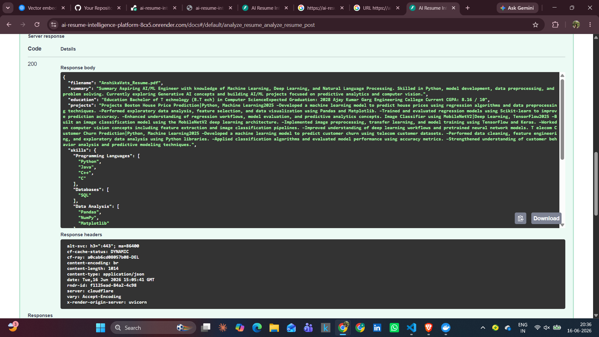
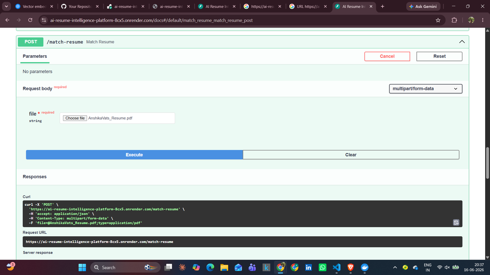
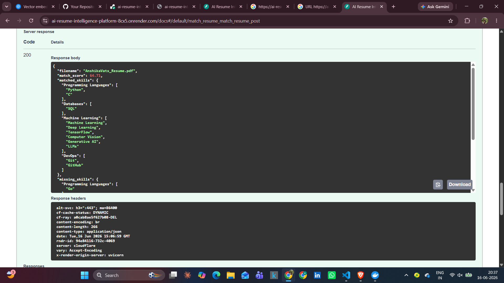

# AI Resume Intelligence Platform


An NLP-powered platform for automated resume analysis, skill extraction, candidate profiling, and resume-job description matching.

---

## Quick Access

| Resource              | Link                                                                   |
| --------------------- | ---------------------------------------------------------------------- |
| Live Application      | https://ai-resume-intelligence-platform-8cx5.onrender.com              |
| Swagger Documentation | https://ai-resume-intelligence-platform-8cx5.onrender.com/docs         |
| GitHub Repository     | https://github.com/vatsanshika923-prog/ai-resume-intelligence-platform |

---

## Overview

AI Resume Intelligence Platform is an NLP-powered application designed to automate resume analysis and candidate-job matching.

The platform extracts information from resumes, identifies technical skills, compares candidate profiles with job descriptions, performs semantic matching, and generates recruiter-focused insights.

This project demonstrates practical applications of Natural Language Processing (NLP), Semantic Search, REST API development, Docker containerization, and cloud deployment.

---

## Problem Statement

Recruiters often receive hundreds of resumes for a single role. Manual screening is time-consuming and may overlook qualified candidates.

This platform helps automate the initial screening process by:

* Extracting information from resumes
* Identifying technical skills
* Matching resumes against job descriptions
* Highlighting missing skills
* Generating candidate insights

---

## Project Highlights

* Developed an NLP-powered Resume Intelligence Platform for automated resume analysis.
* Built REST APIs using FastAPI for resume parsing and candidate-job matching.
* Implemented semantic search capabilities using Sentence Transformers and ChromaDB.
* Containerized the application using Docker.
* Deployed the application on Render with public API access.
* Integrated Swagger UI for interactive API testing and documentation.
* Designed an end-to-end workflow from resume upload to candidate evaluation.

---

## Key Achievements

* Built and deployed a complete AI-powered resume analysis platform.
* Implemented resume parsing, skill extraction, and candidate-job matching workflows.
* Developed REST APIs using FastAPI with interactive Swagger documentation.
* Containerized the application using Docker and deployed it on Render.
* Integrated semantic matching concepts using Sentence Transformers and ChromaDB.

---

## Industry Relevance

This project reflects real-world HRTech and AI Recruitment systems used by modern organizations.

The concepts implemented in this project are commonly used in:

* Applicant Tracking Systems (ATS)
* Resume Screening Platforms
* Recruitment Automation Tools
* Talent Intelligence Systems
* AI-powered Hiring Solutions

The project demonstrates skills relevant to:

* AI Engineering
* NLP Engineering
* Machine Learning Engineering
* Backend Development
* Generative AI Foundations

---

## Features

### Resume Parsing

* PDF resume extraction
* Text cleaning and preprocessing
* Structured section extraction
* Candidate profile generation

### Skill Extraction

* Technical skill identification
* Categorized skill mapping
* Resume skill analysis

### Resume-JD Matching

* Resume vs Job Description comparison
* Match score calculation
* Missing skill detection
* Skill-gap analysis

### Candidate Insights

* Candidate strengths identification
* Recommendation generation
* Recruiter-friendly summaries

### Semantic Search

* Sentence Transformer embeddings
* Semantic similarity matching
* Vector database integration using ChromaDB

### API Services

* FastAPI backend
* Interactive Swagger documentation
* File upload support
* RESTful API architecture

---

## Tech Stack

### NLP & AI

* Python
* Sentence Transformers
* Transformers
* ChromaDB

### Backend

* FastAPI
* Uvicorn

### Data Processing

* PyPDF
* NumPy
* Pandas
* Scikit-learn

### DevOps & Deployment

* Docker
* Render
* GitHub

---

## Project Structure

```text
ai-resume-intelligence-platform/
│
├── app/                    # FastAPI application
├── src/                    # Core NLP and matching modules
├── data/                   # Resumes, job descriptions, skills data
├── docs/
│   └── screenshots/        # README screenshots
├── tests/                  # Testing files
│
├── .gitignore
├── Dockerfile
├── LICENSE
├── README.md
└── requirements.txt
```

---

## Project Architecture

```text
Resume PDF
    │
    ▼
PDF Parser
    │
    ▼
Text Cleaning
    │
    ▼
Section Extraction
    │
    ▼
Skill Extraction
    │
    ├──────────► Candidate Profile
    │
    ▼
Resume-JD Matching
    │
    ▼
Insight Generation
    │
    ▼
FastAPI APIs
    │
    ▼
Swagger UI
    │
    ▼
Render Deployment
```

---
## Architecture Diagram



---


## Example Workflow

1. Upload a Resume PDF.
2. Extract candidate profile information.
3. Identify technical skills from the resume.
4. Compare extracted skills with a job description.
5. Calculate a match score.
6. Identify missing skills.
7. Generate candidate insights and recommendations.

---

## API Endpoints

### GET Endpoints

| Endpoint              | Description                        |
| --------------------- | ---------------------------------- |
| `/`                   | Home                               |
| `/health`             | Health Check                       |
| `/project-info`       | Project Information                |
| `/candidate-profile`  | Candidate Profile Analysis         |
| `/resume-jd-match`    | Resume vs Job Description Matching |
| `/candidate-insights` | Candidate Insights                 |

### POST Endpoints

| Endpoint          | Description     |
| ----------------- | --------------- |
| `/analyze-resume` | Resume Analysis |
| `/match-resume`   | Resume Matching |

---

## Deployment & Access

The application is publicly deployed and accessible through Render.

### Live Application

https://ai-resume-intelligence-platform-8cx5.onrender.com

### Swagger Documentation

https://ai-resume-intelligence-platform-8cx5.onrender.com/docs

### Deployment Pipeline

```text
GitHub → Docker → Render → FastAPI → Swagger UI
```

---

## Screenshots

### Home Page



### Swagger API Documentation





### Resume Analysis API

#### Resume Upload Request



#### Resume Analysis Response



### Resume Matching API

#### Resume Matching Request



#### Resume Matching Response



---

## Future Scope

### Future Enhancements

* Multi-resume comparison
* ATS compatibility scoring
* Resume ranking system
* Recruiter dashboard
* Authentication and user management
* Resume history tracking
* Cloud database integration

### Generative AI Enhancements

* LLM-powered resume feedback
* AI-generated resume improvement suggestions
* AI interview preparation assistant
* Personalized career recommendations
* Retrieval-Augmented Generation (RAG)
* Conversational Resume Assistant

---

## Learning Outcomes

Through this project, I gained practical experience in:

* Natural Language Processing (NLP)
* Information Extraction
* Semantic Search
* Vector Databases
* FastAPI Development
* REST API Design
* Docker Containerization
* Cloud Deployment
* GitHub Project Management
* End-to-End AI Application Development

---

## Author

**Anshika Vats**

GitHub: https://github.com/vatsanshika923-prog

LinkedIn: https://www.linkedin.com/in/anshika-vats/

---

## License

This project is licensed under the MIT License. See the LICENSE file for details.